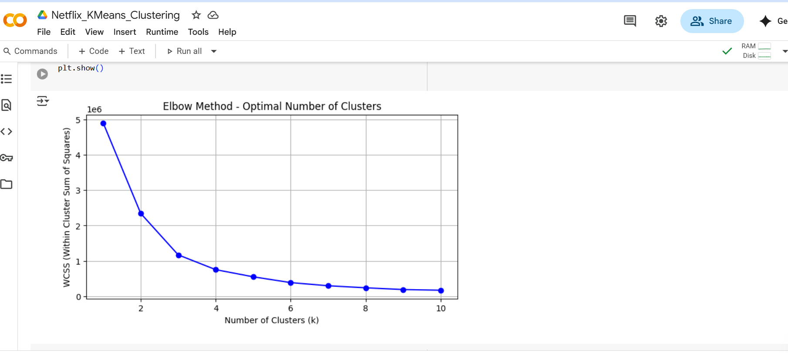
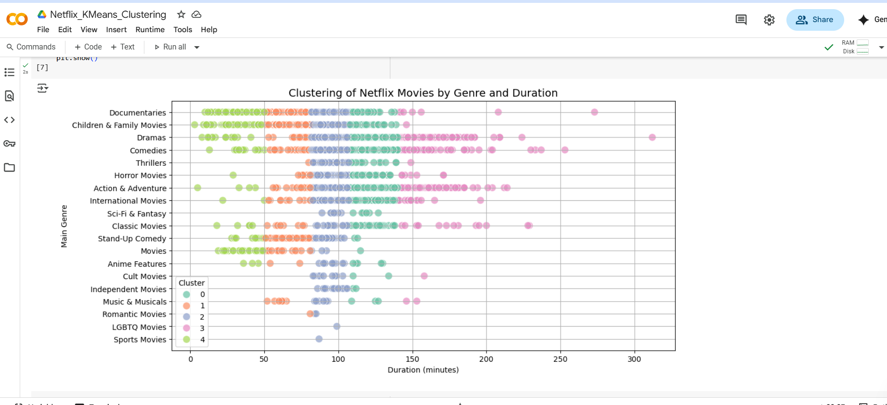

# 🎬 Netflix Show Clustering

This project uses **K-Means Clustering** to group Netflix Movies based on:

- Main genre (e.g., Action, Comedy)
- Duration (in minutes)

---

## 📂 Dataset

- Source: [Kaggle Netflix Titles Dataset](https://www.kaggle.com/datasets/shivamb/netflix-shows)

---

## 💻 Tech Stack

- Python
- Pandas
- Scikit-learn
- Seaborn
- Google Colab

---

## 🔍 What I Did

- Cleaned and filtered data (only movies)
- Extracted main genres
- Converted genres using One-Hot Encoding
- Applied **K-Means Clustering**
- Used the **Elbow Method** to find optimal number of clusters
- Visualized results using **Seaborn**
- Added insights + cluster examples

---

## 📈 Elbow Method

---

## 🎨 Cluster Visualization

---

## 🧠 Sample Cluster Insights

| Cluster | Most Common Genre | Avg Duration |
|---------|-------------------|--------------|
| 0       | Comedy            | ~90 mins     |
| 1       | Drama             | ~110 mins    |
| ...     | ...               | ...          |

---

## 🔗 Run it Yourself on Colab

👉 [Click here to view Colab Notebook](https://colab.research.google.com/drive/12VgQ1ZzvvZRSiAccNbpQbWycvXvsjgnj?usp=sharing)

---

## ⭐️ Star this repo if you liked it!
